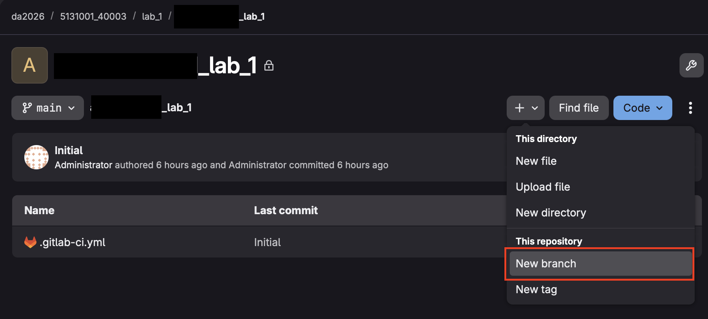
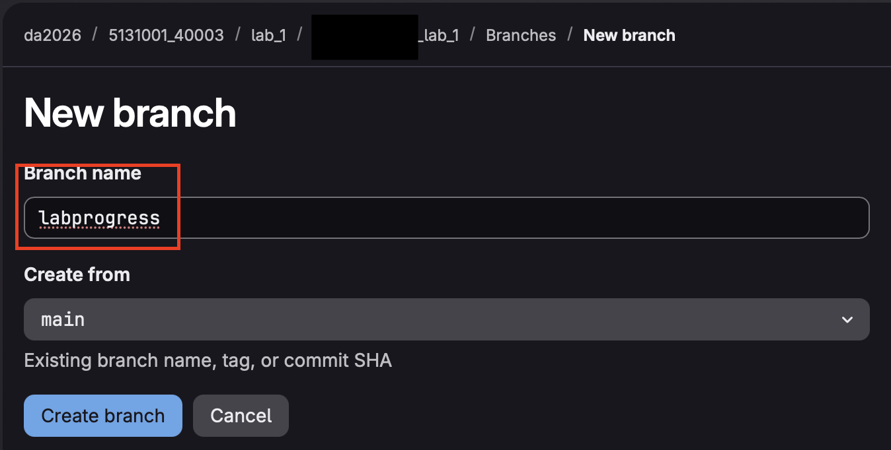
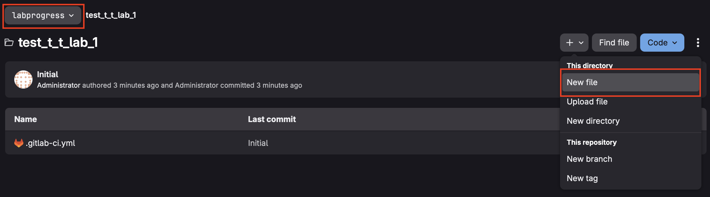
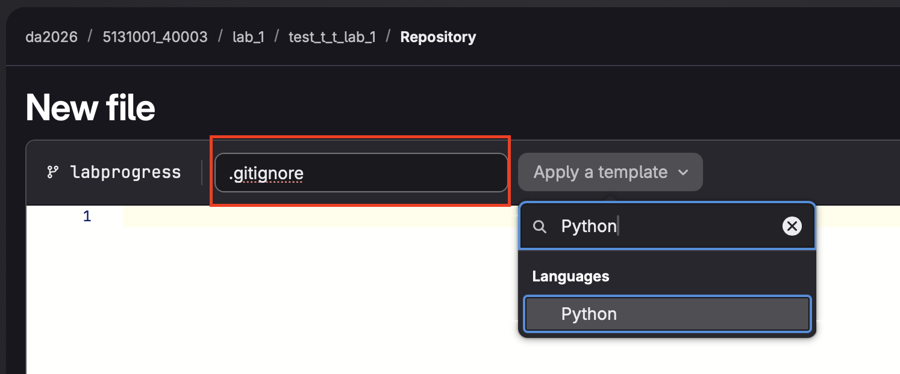
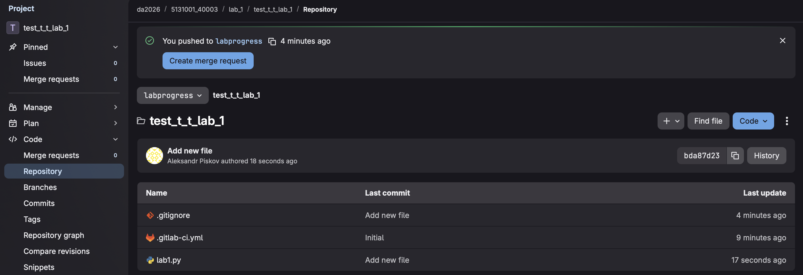
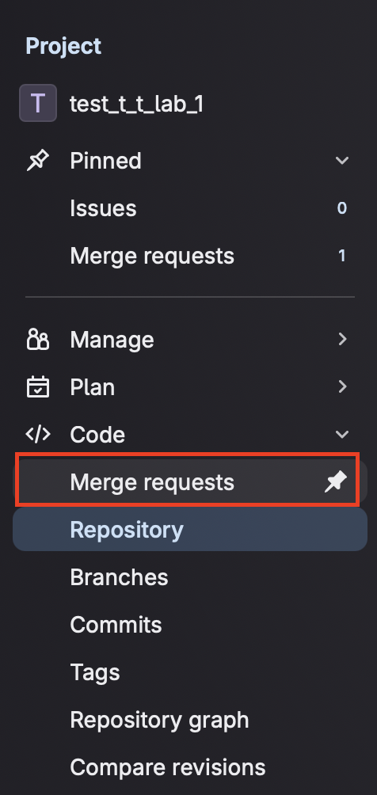
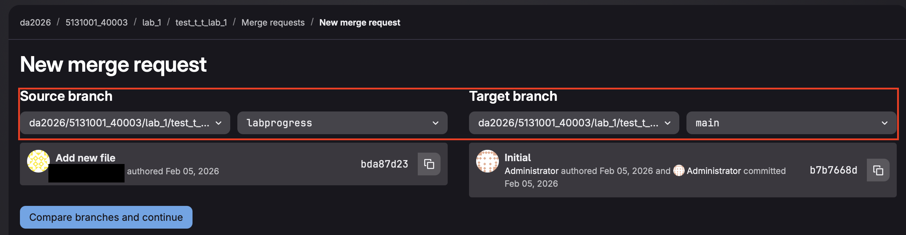
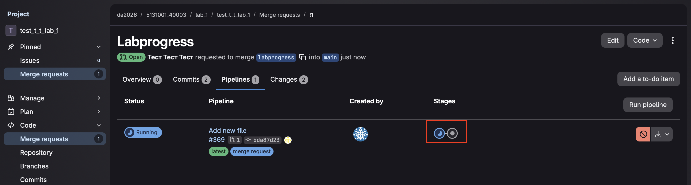
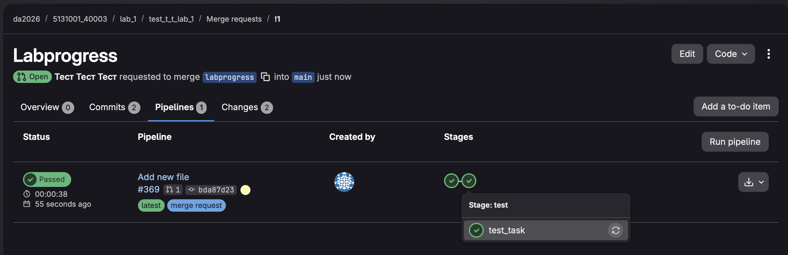
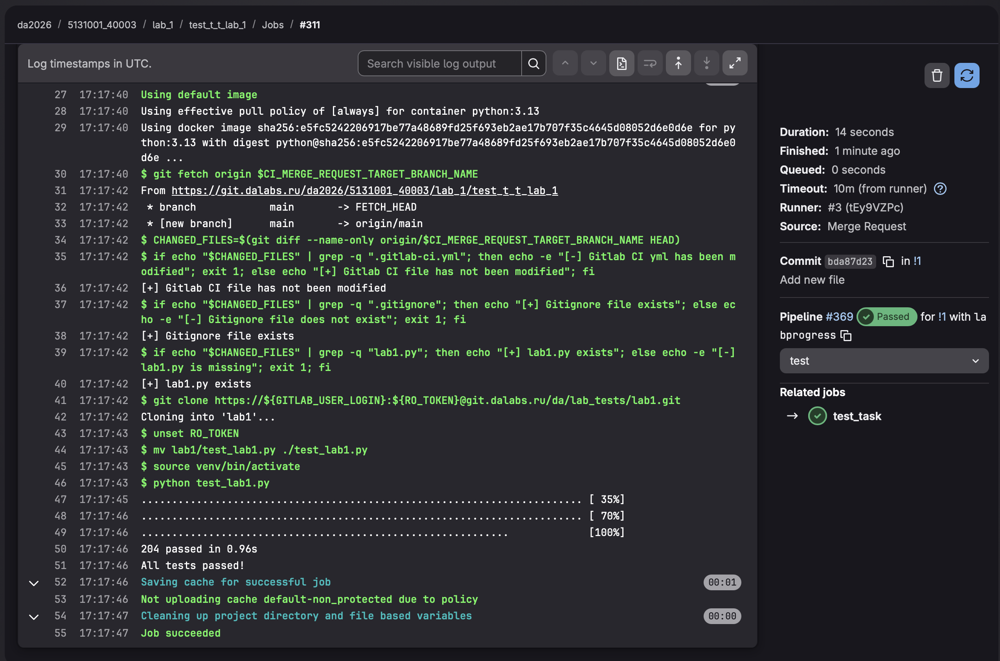

Для корректного запуска автотестов по коду лабораторной работы необходимо:
- создать новую ветку из main'а с названием "labprogress". Для этого необходимо зайти в свой личный репозиторий в web-UI(например, https://git.dalabs.ru/da2026/5131001_40003/lab_1/{ваш никнейм в формте фамилия_и_о}_lab_1) и выполнить следующие действия:





- в созданной ветке labprogress создать файл .gitignore из шаблона gitlab'а:



В открывшемся меню указать название файла .gitignore и выбрать из выпадающего меню "Python":

После этого нажать Commit changes -> Commit changes

- склонировать репозиторий, выполнив следующие команды:
```
git clone https://git.dalabs.ru/da2026/5131001_40003/lab_1/test_t_t_lab_1
cd test_t_t_lab_1
git checkout labprogress
```

- в директории склонированного репозитория (в данном примере - test_t_t_lab_1) создать файл с исходным кодом лабораторной работы (lab1.py), реализовать функционал в соответствии с заданием

- сделать commit и push:
```
git add .
git commit -am "Add new file"
git push
```

- в web-UI проверить наличие всех необходимых файлов:



- создать merge-request, для этого в web-UI:

Перейти в разел Merge requests -> New merge request:



Выбрать labprogress в качестве Source branch, main в качестве Target branch:

Нажать Compare branches and continue, в открывшемся меню оставить все без изменений, нажать Create merge request

В созданном merge request'е (далее - MR) перейти во вкладку Pipelines. В данной вкладке будет отображаться процесс запуска автотестов, который включает в себя две задачи: подготовка зависимостей и запуск скрипта с тестами:


Для просмотра логов скрипта с тестами необходимо перейти в соотвествующую задачу:


Пример логов в случае успешного прохождения всех тестов:
